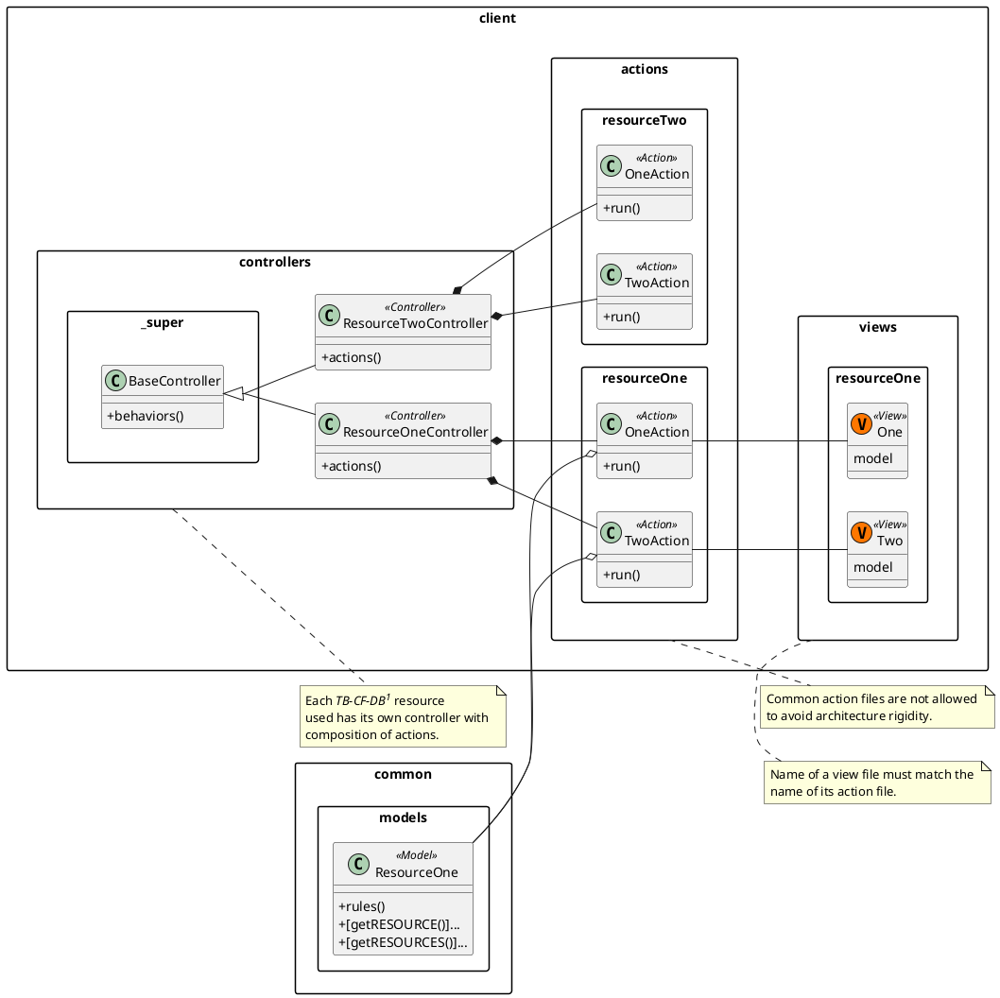

# TopBrains - Code Fest - Web Application
TopBrains Code Fest web application by TB-CORP LLC. The application follows [monolithic architecture](https://en.wikipedia.org/wiki/Monolithic_application) and build as SPA using [Yii2](https://www.yiiframework.com/) PHP framework. The application is in its prototype stage, which is ready to be used for demostration purposes.

---

## Contents
- [Introduction](#topbrains---code-fest---web-application)
- [Architecture](#architecture)

## Architecture
The project is a [monolithic application](https://en.wikipedia.org/wiki/Monolithic_application), which briefly means that the application is self-contained and do not depend on other applications. The architecture diagram is a conceptual diagram, which shares the idea behind the application structure, but not list it. Install [browser extension](https://chrome.google.com/webstore/detail/markdown-diagrams/pmoglnmodacnbbofbgcagndelmgaclel), if you do not see the diagram.

### References
1. [TB-CF-DB](https://github.com/TB-CORP/TB-CF-database). Database design of the TopBrains Code Fest project.
